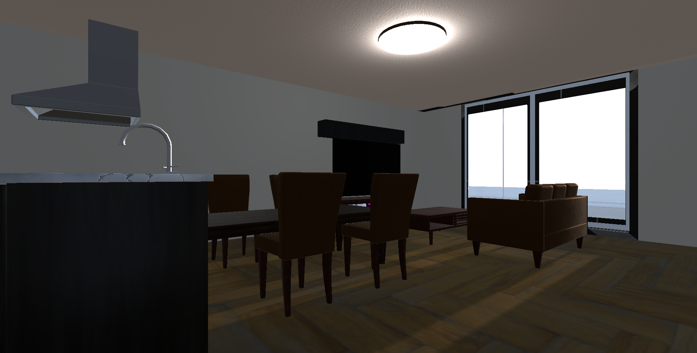

# Pun2_3D_HouseSimulator
## 概要
博士前期課程研究  
「VRを用いたインテリアとエクステリア設計のためのマルチユーザーシームレスシミュレーションシステムの開発」  
のUnityプロジェクト

※実際のVRシステムでなく、Unityの簡単な3Dエミュレータ  
※開発したVRシステムとほとんど同じです

## 実装した機能
1. インテリアとエクステリアのシームレスな閲覧 (FPS視点とTPS視点の切り替え, ドアと窓などの開閉)  
2. 複数のユーザー間の通信 (最大5人までの通信, 一人と複数人の切り替え, ホスト側での自動セーブとロード)  
3. 移動機能 (キー移動, 視点回転, ワープ)  
4. 3Dオブジェクトの操作 (生成, 配置, 回転, 破棄)  
5. 照明シミュレーション (照明のオンオフ, 明るさの変化, 種類の切り替え)  
6. 建物の内外の材質変更 (屋根, 外壁, 天井, 内壁, 床, 階段, ドアなど)  
7. 時間帯シミュレーション (日照, 街灯の変化)  

## 実装のポイント
### クラス設計とデータ構造
・ クラス単一責任の原則を意識  
・ UI層とロジック層の分離  
・ 可読性の向上、nullチェック  
・ デザインパターン(ファクトリーバターン)の使用  
・ Scriptableオブジェクトの導入  
・ セーブロード機能、同期機能において、継承を使用してコード量を削減

### 通信,データ容量の削減
・ 新規ユーザーの同期は、差分バッチ、gzip+Base64の圧縮、キューによる送信間隔の制御  
・ RPC通信において、数値に閾値を設け、小さい差分は無視し、送信を制御  
・ RPC通信において、連打による重複送信の防止  
・ 所有権の譲渡のタイミングの制御  
・ セーブ機能において、gzip+Base64の圧縮で大量オブジェクトでも容量削減

### 計算量の削減
・ 大量オブジェクトの探索でキャッシュを利用し、o(n)から2回目以降はO(1)に削減  
・ 定期的なキャッシュの削除で、メモリの使用量も削減  
・ 家ヒエラルキーのDFS探索で、再帰ではなくスタックを使用し、スタックオーバーフローも回避

## Demo

※家の内部構造なども全て自分で作成しています

## 使用技術
__C#, Unity, Pun2__
